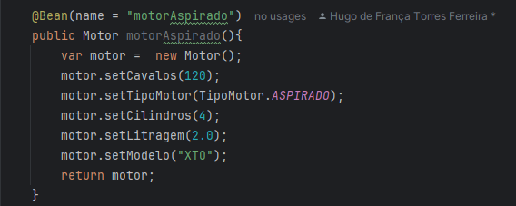

# Arquitetura Spring

Entendendo e configurando a Arquiterura do Spring, material e exemplos do curso [Spring Boot Expert](https://www.udemy.com/share/102JK83@yMUhp6sNxBDA-kgPLyYSZnnMzDzWczMTFQlAVcNVOYIUKF2rjqSA3324jlIoyGoJvw==/)

- [Classe Application](#Classe-Application)
- [Configuration e Bean](#Configuration-e-Bean)

## Classe Application

"A classe application é responsável por configurar e iniciar a aplicação. Ela contém o método run(), que lança a aplicação e configura os componentes do Spring."

A estrutura básica de uma aplicação Spring Boot geralmente inclui uma classe principal (com a anotação @SpringBootApplication) que chama o método run() da classe SpringApplication 
para iniciar a aplicação.

### Anotação @SpringBootApplication

"É uma combinação de anotações  que ajudam a configurar e inicializar um aplicativo Spring Boot de forma simplificada. Existem 3 principais anotações:"

@Configuration: Indica que a classe pode ser usada como uma fonte de definições de beans no contexto da aplicação.

@EnableAutoConfiguration: Diz ao Spring Boot para começar a configurar automaticamente os beans necessários com base nas dependências presentes no classpath. Isso ajuda a reduzir a 
quantidade de configuração manual que você teria que fazer, pois o Spring Boot configura muitos aspectos de sua aplicação automaticamente, como fontes de dados, web servers, segurança, 
entre outros.

@ComponentScan: Permite que o Spring procure por componentes, configurações e serviços em pacotes específicos. Por padrão, ela faz com que o Spring Boot procure por componentes em pacotes 
dentro do mesmo pacote da classe onde a anotação @SpringBootApplication está.

### Spring Application Builder

"A classe SpringApplicationBuilder é uma ferramenta fornecida pelo Spring Boot para ajudar a construir e configurar uma aplicação Spring Boot de maneira mais flexível, especialmente quando você precisa personalizar ou modificar as configurações de inicialização do aplicativo."

"Ela é uma alternativa ao uso direto do método estático SpringApplication.run() quando você deseja ter um controle maior sobre o processo de inicialização do aplicativo."

Comentei o SpringApplication para rodar manualmente com o SpringApplciationBuilder e fazer configuração adicionais:

Existem diversas configurações, remover o banner Mode, configurar contexto da applicação, rodar aplicação apontando para perfils, configurações com environment, etc.

### @Configuration e Bean

A anotação @Configuration no Spring Framework é usada para indicar que uma classe contém configurações de beans. Em outras palavras, ela define uma classe como uma fonte de definições de beans que o Spring irá usar para configurar o contexto da aplicação.

Quando você anota uma classe com @Configuration, ela funciona de maneira similar a um arquivo de configuração XML no Spring, mas de forma mais moderna e orientada a código Java. Essa anotação é utilizada para registrar beans que podem ser usados em toda a aplicação.

 #### Bean

 é usada para definir um método que cria um bean que será gerido pelo Spring IoC container. Basicamente, ela permite que você registre objetos dentro do contexto do Spring de forma programática, em vez de utilizar arquivos de configuração XML.

básicamente uma forma de você criar objetos e passar como injeção de dependencia sem que seja passada por um cronstrutor ou uma instanciação de objeto:

Na prática, na sua classe Controller, quando você definir uma variavel da classe para se realizar a injação de dependência, você utilizar o @Autowired (Quando você usa @Autowired, o Spring cuida de injetar o objeto necessário, sem que você precise criá-lo manualmente. Ela é usada para realizar injeção de dependência.).

#### E se tiver mais de um Bean ?

 Você pode definir multiplos beans no seu programa, dependendo da lógica do seu programa não utilizamos uma instancia de objeto da mesma classe, e sim multiplas. Mas como diferenciar uma da outra ? Existe algumas formas, mas primeiro caso você não diferencie, em tempo de execução retornarar um error dizendo que há multiplas beans mais a jvm não sabe qual injetar, nesse caso existe uma anotação chamada @Qualifier, ela é usada para especificar qual beans você quer utilizar, com o parametro determinado pelo nome do metodo.

Defenindo mais beans:

 

 

 

Qualifier na prática: 

Retorno: 

Você pode denifir um metodo como padrão caso esqueça de definir no seu controller qual é o qualifier, através da anotação @Primary: 

 

Existe outra forma de usar o @Qualifier, através de anotação personalizada. Elas são exemplos de bom uso, e deixão o código mais limpo:

"A anotação @Retention no Java é usada para indicar em qual fase do ciclo de vida da anotação ela estará disponível. Quando você aplica @Retention em uma anotação personalizada, você está especificando o nível de visibilidade dessa anotação, ou seja, onde e por quanto tempo ela será acessível". No caso em RunTime: " RetentionPolicy.RUNTIME: A anotação será retida no bytecode e estará acessível em tempo de execução. Isso significa que você pode acessá-la programaticamente durante a execução do programa, geralmente por meio de reflexão. Isso é essencial para anotações usadas em frameworks como o Spring, que podem ler e processar anotações durante a execução."

"A anotação @Target é usada em anotações personalizadas para especificar onde a anotação pode ser aplicada. Ou seja, ela define os alvos possíveis de uma anotação (por exemplo, métodos, classes, campos, parâmetros, etc.). Quando você cria uma anotação personalizada, o @Target ajuda a garantir que a anotação só possa ser usada nos locais apropriados." 

Em uso: 

Retorno: 

